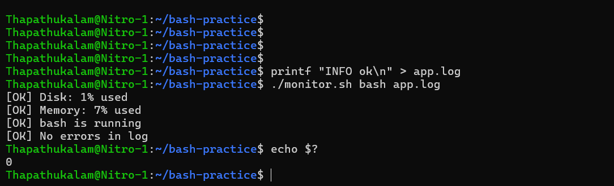
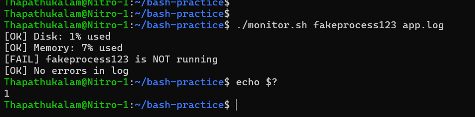
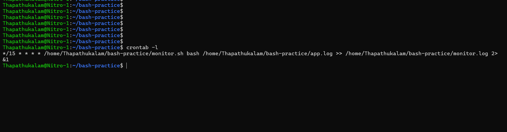

# Server & Log Health Monitor

A Bash script that checks a Linux machine's health and reports problems through its output and exit code, so cron or a CI pipeline can act on the result.

Script: [`monitor.sh`](monitor.sh)

## What it checks

- **Disk usage** of `/` (warns above 80%)
- **Memory usage** (warns above 80%)
- **Process status** (is a named process running?)
- **Log scan** (counts `ERROR` lines in a log file)

It exits `0` if everything is healthy and `1` if any check produced a WARN or FAIL.

## Usage

```bash
chmod +x monitor.sh
./monitor.sh <process_name> <log_file>
```

Example:

```bash
./monitor.sh nginx /var/log/app.log
echo $?    # 0 = healthy, 1 = problems found
```

## Example output

Healthy run:



Failing run (process not running):



## Scheduling with cron

Run it every 15 minutes and append the output to a log file:

```
*/15 * * * * /home/<user>/bash-practice/monitor.sh bash /home/<user>/bash-practice/app.log >> /home/<user>/bash-practice/monitor.log 2>&1
```



Cron has no working directory or interactive `$PATH`, so every path must be absolute.

## Notes

- `set -euo pipefail` is enabled, so commands that legitimately return non-zero (like `grep` finding no matches) are guarded with `|| true`.
- The process check filters out `grep` and the script itself, so it never reports a false positive.
